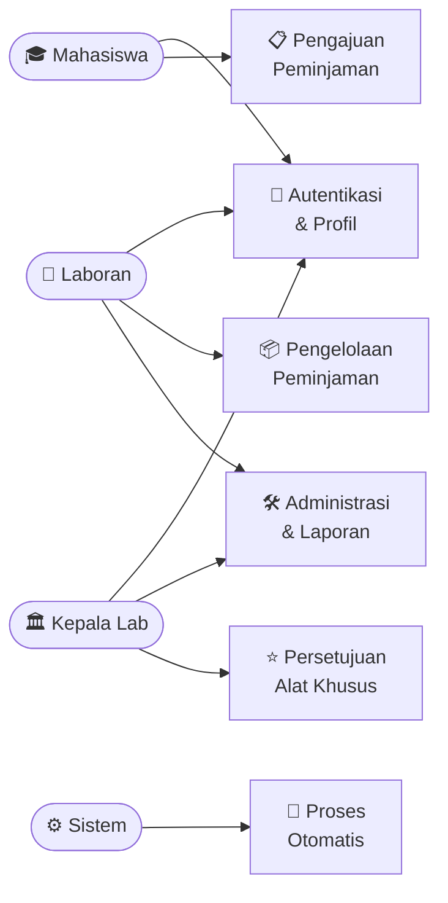
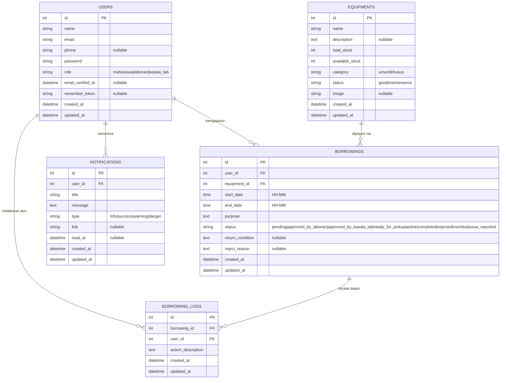

# 🔬 LabManager — Sistem Peminjaman Alat Laboratorium IT

> Aplikasi web berbasis **Laravel 11** untuk mengelola peminjaman alat di laboratorium IT, dengan sistem persetujuan multi-level (Mahasiswa → Laboran → Kepala Lab).

---

## 📋 Daftar Isi

- [Tentang Proyek](#-tentang-proyek)
- [Fitur Utama](#-fitur-utama)
- [Use Case Diagram](#-use-case-diagram)
- [ERD (Entity Relationship Diagram)](#-erd-entity-relationship-diagram)
- [Alur Peminjaman](#-alur-peminjaman)
- [Role & Akses](#-role--akses)
- [Tech Stack](#-tech-stack)
- [Struktur Database](#-struktur-database)
- [Struktur Direktori](#-struktur-direktori)
- [Instalasi & Setup](#-instalasi--setup)
- [Akun Default (Seeder)](#-akun-default-seeder)
- [Alat yang Tersedia (Seeder)](#-alat-yang-tersedia-seeder)
- [Artisan Commands](#-artisan-commands)
- [Konfigurasi Penting](#-konfigurasi-penting)
- [Middleware & Keamanan](#-middleware--keamanan)

---

## 📌 Tentang Proyek

**LabManager** adalah sistem informasi manajemen peminjaman alat laboratorium yang dirancang khusus untuk **Lab IT**. Sistem ini memungkinkan mahasiswa mengajukan peminjaman alat secara online, dengan alur persetujuan bertingkat berdasarkan kategori alat:

- **Alat Umum** → cukup disetujui oleh **Laboran**
- **Alat Khusus** → wajib disetujui **Laboran** *dan* **Kepala Lab**

Setiap transaksi dicatat dalam **audit log** (riwayat aktivitas) untuk keperluan tracking dan akuntabilitas. Mahasiswa mendapatkan **notifikasi real-time** di setiap perubahan status peminjaman.

---

## ✨ Fitur Utama

| Fitur | Keterangan |
|---|---|
| 🔐 Autentikasi | Login, register, logout, "ingat saya" (3 jam / 1 hari) |
| 📧 Verifikasi Email | Mahasiswa wajib verifikasi email sebelum meminjam |
| 🔑 Reset Password | Reset password melalui email |
| 👥 Multi-Role | Mahasiswa, Laboran, Kepala Lab |
| 📦 Manajemen Alat | CRUD alat, kategori, status, stok (dengan validasi stok aktif) |
| 🖼️ Gambar Alat | Upload & tampilan gambar alat |
| 📋 Katalog Alat | Halaman katalog Mahasiswa dengan filter & pencarian |
| 📝 Pengajuan Peminjaman | Form peminjaman dengan validasi waktu (08:00–20:00) |
| ✅ Approval Multi-Level | Laboran + Kepala Lab (untuk alat khusus) |
| 🤝 Serah Terima | Laboran mengkonfirmasi penyerahan alat ke peminjam |
| 🔄 Pengembalian | Proses pengembalian dengan catatan kondisi alat |
| ❌ Penolakan | Laboran / Kepala Lab dapat menolak dengan alasan |
| 🚫 Pembatalan | Mahasiswa dapat membatalkan pengajuan yang masih pending |
| ⚠️ Laporan Masalah | Mahasiswa laporkan masalah alat, Laboran menangani |
| 🔔 Notifikasi | Notifikasi otomatis di setiap perubahan status |
| 👤 Manajemen User | Laboran kelola Mahasiswa; Kepala Lab kelola Laboran |
| 📄 Export Laporan | Export data peminjaman ke PDF (dompdf) & CSV |
| 📊 Dashboard | Dashboard spesifik per role dengan statistik |
| 📜 Audit Log | Riwayat setiap aksi tersimpan di `borrowing_logs` |
| ⏰ Overdue Otomatis | Scheduler harian menandai peminjaman yang terlambat |
| 🛡️ Race Condition Guard | DB locking saat pengajuan untuk mencegah double-booking |
| 🔒 Session Management | Middleware custom untuk enforce session lifetime dinamis |
| 🌗 Dark Mode | Toggle mode gelap/terang |
| 👤 Profil | User dapat mengedit nama, email, telepon, dan password |

---

## 📊 Use Case Diagram

### Overview — Aktor & Kelompok Fitur



### Detail Use Case per Aktor

<table>
<thead>
<tr>
  <th>🎓 Mahasiswa</th>
  <th>🔬 Laboran</th>
  <th>🏛️ Kepala Lab</th>
  <th>⚙️ Sistem Otomatis</th>
</tr>
</thead>
<tbody>
<tr>
  <td>Register akun baru</td>
  <td>Login & logout</td>
  <td>Login & logout</td>
  <td>Kirim email verifikasi</td>
</tr>
<tr>
  <td>Login & logout</td>
  <td>Edit profil & telepon</td>
  <td>Edit profil & telepon</td>
  <td>Kirim email reset password</td>
</tr>
<tr>
  <td>Verifikasi email</td>
  <td>Setujui peminjaman alat umum</td>
  <td>Setujui peminjaman alat khusus</td>
  <td>Kirim notifikasi in-app</td>
</tr>
<tr>
  <td>Reset password</td>
  <td>Tolak peminjaman</td>
  <td>Tolak peminjaman</td>
  <td>Tandai overdue (scheduler)</td>
</tr>
<tr>
  <td>Edit profil & telepon</td>
  <td>Serah terima alat ke peminjam</td>
  <td>Lihat semua peminjaman</td>
  <td>Enforce session timeout</td>
</tr>
<tr>
  <td>Lihat katalog alat</td>
  <td>Proses pengembalian alat</td>
  <td>Kelola akun Laboran</td>
  <td></td>
</tr>
<tr>
  <td>Ajukan peminjaman</td>
  <td>Tangani laporan masalah</td>
  <td>Export laporan PDF/CSV</td>
  <td></td>
</tr>
<tr>
  <td>Batalkan pengajuan</td>
  <td>Kelola alat (CRUD + gambar)</td>
  <td>Dashboard & statistik</td>
  <td></td>
</tr>
<tr>
  <td>Laporkan masalah alat</td>
  <td>Kelola akun Mahasiswa</td>
  <td></td>
  <td></td>
</tr>
<tr>
  <td>Lihat riwayat peminjaman</td>
  <td>Export laporan PDF/CSV</td>
  <td></td>
  <td></td>
</tr>
<tr>
  <td>Lihat notifikasi</td>
  <td>Dashboard & statistik</td>
  <td></td>
  <td></td>
</tr>
</tbody>
</table>

---

## 🗃️ ERD (Entity Relationship Diagram)



---

## 🔄 Alur Peminjaman

### Alat Umum (Kategori: `umum`)

```
Mahasiswa → [pending] → Laboran Setujui → [ready_for_pickup]
         → Laboran Serah Terima → [active]
         → Laboran Proses Kembali → [completed]
```

### Alat Khusus (Kategori: `khusus`)

```
Mahasiswa → [pending] → Laboran Setujui → [approved_by_laboran]
         → Kepala Lab Setujui → [approved_by_kepala_lab]
         → Laboran Serah Terima → [active]
         → Laboran Proses Kembali → [completed]
```

### Diagram Alur Lengkap (State Machine)

```mermaid
flowchart LR
    START(( )) -->|Mahasiswa ajukan| pending

    pending -->|Laboran setujui - alat UMUM| ready_for_pickup
    pending -->|Laboran setujui - alat KHUSUS| approved_by_laboran
    pending -->|Tolak / Batalkan| rejected

    approved_by_laboran -->|Kepala Lab setujui| approved_by_kepala_lab
    approved_by_laboran -->|Kepala Lab tolak| rejected

    approved_by_kepala_lab -->|Laboran serah terima| active
    ready_for_pickup -->|Laboran serah terima| active

    active -->|Laboran proses kembali| completed
    active -->|Jam terlewat - Scheduler| overdue
    active -->|Mahasiswa laporkan masalah| issue_reported

    overdue -->|Laboran proses kembali| completed

    issue_reported -->|Lanjutkan peminjaman| active
    issue_reported -->|Selesaikan dan kembalikan| completed

    completed --> STOP(( ))
    rejected  --> STOP

    style START fill:#1e293b,stroke:#1e293b
    style STOP  fill:#1e293b,stroke:#1e293b
    style pending           fill:#fef3c7,stroke:#f59e0b,color:#92400e
    style approved_by_laboran     fill:#dbeafe,stroke:#3b82f6,color:#1e40af
    style approved_by_kepala_lab  fill:#ede9fe,stroke:#8b5cf6,color:#4c1d95
    style ready_for_pickup  fill:#d1fae5,stroke:#10b981,color:#065f46
    style active            fill:#d1fae5,stroke:#059669,color:#064e3b
    style completed         fill:#f1f5f9,stroke:#64748b,color:#334155
    style overdue           fill:#fee2e2,stroke:#ef4444,color:#991b1b
    style issue_reported    fill:#ffedd5,stroke:#f97316,color:#7c2d12
    style rejected          fill:#fce7f3,stroke:#ec4899,color:#831843
```



### Status Peminjaman

| Status | Label | Keterangan |
|---|---|---|
| `pending` | Menunggu Persetujuan | Baru diajukan mahasiswa |
| `approved_by_laboran` | Disetujui Laboran | Menunggu persetujuan Kepala Lab (alat khusus) |
| `approved_by_kepala_lab` | Disetujui Kepala Lab | Menunggu serah terima oleh Laboran |
| `ready_for_pickup` | Siap Diambil | Alat umum sudah disetujui Laboran |
| `active` | Sedang Dipinjam | Alat sudah diserahkan ke peminjam |
| `completed` | Selesai | Alat sudah dikembalikan |
| `rejected` | Ditolak / Dibatalkan | Ditolak oleh admin atau dibatalkan mahasiswa |
| `overdue` | Terlambat | Melewati waktu pengembalian (otomatis via scheduler) |
| `issue_reported` | Ada Masalah | Status untuk pelaporan masalah alat |

---

## 👤 Role & Akses

### Mahasiswa
- Mendaftar akun & verifikasi email
- Melihat katalog alat yang tersedia (filter pencarian & kategori)
- Mengajukan permintaan peminjaman
- Membatalkan pengajuan yang masih pending
- Melaporkan masalah pada alat yang sedang dipinjam
- Melihat riwayat peminjaman sendiri
- Menerima notifikasi otomatis saat status berubah
- Mengedit profil (nama, email, telepon, password)

### Laboran
- Melihat semua permintaan peminjaman (filter & pencarian)
- Menyetujui / menolak permintaan (`pending`)
- Melakukan serah terima alat (`ready_for_pickup`, `approved_by_kepala_lab`)
- Memproses pengembalian alat (`active`, `overdue`)
- Menangani laporan masalah dari mahasiswa (`issue_reported`)
- Mengelola alat (tambah, edit, hapus, upload gambar)
- **Mengelola akun Mahasiswa** (tambah, edit, hapus)
- Export laporan peminjaman ke PDF & CSV
- Dashboard dengan statistik lengkap

### Kepala Lab
- Menyetujui / menolak peminjaman alat khusus (`approved_by_laboran`)
- Melihat semua data peminjaman
- **Mengelola akun Laboran** (tambah, edit, hapus)
- Export laporan peminjaman ke PDF & CSV
- Dashboard dengan ringkasan persetujuan

> **Catatan Hierarki Manajemen User:** Laboran hanya dapat mengelola akun Mahasiswa; Kepala Lab hanya dapat mengelola akun Laboran. Tidak ada role yang dapat mengelola akun dengan level yang sama atau lebih tinggi.

---

## 🛠️ Tech Stack

### Backend

| Komponen | Versi / Detail |
|---|---|
| **PHP** | `^8.2` |
| **Laravel** | `^11.31` |
| **Laravel DomPDF** | `barryvdh/laravel-dompdf ^3.1` (Export PDF) |
| **Laravel Tinker** | `^2.9` |
| **Database** | SQLite (default), dapat diubah ke MySQL/PostgreSQL |
| **Session Driver** | Database |
| **Queue Driver** | Database |
| **Cache Driver** | Database |
| **Timezone** | `Asia/Jakarta` |

### Frontend

| Komponen | Versi / Detail |
|---|---|
| **Vite** | `^6.0.11` (build tool) |
| **laravel-vite-plugin** | `^1.2.0` (integrasi Vite + Laravel) |
| **Tailwind CSS** | `^3.1.0` (utility classes) |
| **@tailwindcss/forms** | `^0.5.2` (plugin form styling) |
| **Alpine.js** | `^3.x` (reactive UI — via CDN di layout) |
| **Axios** | `^1.7.4` (HTTP client) |

### Dev Tools

| Komponen | Keterangan |
|---|---|
| **Laravel Pint** | Code style fixer (PSR-12) |
| **Laravel Pail** | Log viewer di terminal |
| **PHPUnit** | `^11.0.1` — unit & feature testing |

---

## 🗄️ Struktur Database

### Tabel `users`

| Kolom | Tipe | Keterangan |
|---|---|---|
| `id` | integer | Primary key |
| `name` | varchar | Nama lengkap |
| `email` | varchar | Email (unique) |
| `phone` | varchar(20) | Nomor telepon (nullable) |
| `password` | varchar | Password (bcrypt) |
| `role` | varchar | `mahasiswa` / `laboran` / `kepala_lab` |
| `email_verified_at` | datetime | Nullable — wajib diisi untuk mahasiswa |
| `remember_token` | varchar | Nullable |
| `created_at` / `updated_at` | datetime | Timestamps |

### Tabel `equipments`

| Kolom | Tipe | Keterangan |
|---|---|---|
| `id` | integer | Primary key |
| `name` | varchar | Nama alat |
| `description` | text | Deskripsi alat |
| `total_stock` | integer | Total stok keseluruhan |
| `available_stock` | integer | Stok yang tersedia untuk dipinjam |
| `category` | enum | `umum` / `khusus` |
| `status` | enum | `good` / `maintenance` |
| `image` | varchar | Nama file gambar (nullable, hasil upload) |
| `created_at` / `updated_at` | datetime | Timestamps |

### Tabel `borrowings`

| Kolom | Tipe | Keterangan |
|---|---|---|
| `id` | integer | Primary key |
| `user_id` | FK → users | Peminjam |
| `equipment_id` | FK → equipments | Alat yang dipinjam |
| `start_date` | time | Waktu mulai pinjam (HH:MM) |
| `end_date` | time | Waktu pengembalian (HH:MM) |
| `purpose` | text | Tujuan peminjaman |
| `status` | varchar | Status peminjaman (9 status) |
| `return_condition` | text | Kondisi alat saat dikembalikan (nullable) |
| `reject_reason` | text | Alasan penolakan atau "Dibatalkan oleh peminjam." (nullable) |
| `created_at` / `updated_at` | datetime | Timestamps |

> **Catatan:** `start_date` dan `end_date` menyimpan **waktu dalam sehari** (format `HH:MM`), bukan tanggal penuh. Sistem peminjaman berlaku untuk hari yang sama, dalam jam operasional **08:00 – 20:00 WIB**.

### Tabel `borrowing_logs`

| Kolom | Tipe | Keterangan |
|---|---|---|
| `id` | integer | Primary key |
| `borrowing_id` | FK → borrowings | Referensi peminjaman |
| `user_id` | FK → users | Siapa yang melakukan aksi |
| `action_description` | text | Deskripsi aksi yang dilakukan |
| `created_at` / `updated_at` | datetime | Timestamps |

### Tabel `notifications`

| Kolom | Tipe | Keterangan |
|---|---|---|
| `id` | integer | Primary key |
| `user_id` | FK → users | Penerima notifikasi |
| `title` | varchar | Judul notifikasi |
| `message` | text | Isi pesan notifikasi |
| `type` | varchar | `info` / `success` / `warning` / `danger` |
| `link` | varchar | URL terkait (nullable) |
| `read_at` | datetime | Waktu dibaca (nullable) |
| `created_at` / `updated_at` | datetime | Timestamps |

### Tabel Sistem Laravel

| Tabel | Keterangan |
|---|---|
| `sessions` | Penyimpanan sesi pengguna (driver: database) |
| `cache` | Cache aplikasi (driver: database) |
| `jobs` / `job_batches` / `failed_jobs` | Queue system |

---

## 📁 Struktur Direktori

```
project-frame(lab IT)/
├── app/
│   ├── Console/
│   │   └── Commands/
│   │       └── MarkOverdueBorrowings.php   # Command scheduler overdue + notifikasi
│   ├── Http/
│   │   ├── Controllers/
│   │   │   ├── Auth/
│   │   │   │   ├── AuthenticatedSessionController.php  # Login + session lifetime
│   │   │   │   ├── EmailVerificationController.php     # Verifikasi email
│   │   │   │   ├── NewPasswordController.php           # Reset password
│   │   │   │   └── RegisteredUserController.php        # Registrasi mahasiswa
│   │   │   ├── BorrowingController.php     # Logika peminjaman + notifikasi lengkap
│   │   │   ├── DashboardController.php     # Dashboard per-role
│   │   │   ├── EquipmentController.php     # CRUD alat + katalog + validasi stok
│   │   │   ├── NotificationController.php  # Daftar & mark-read notifikasi
│   │   │   ├── ProfileController.php       # Edit profil (nama, email, phone, password)
│   │   │   └── UserController.php          # CRUD user (Laboran→Mahasiswa; KepLab→Laboran)
│   │   ├── Middleware/
│   │   │   ├── RoleMiddleware.php          # Guard akses berbasis role
│   │   │   └── EnforceSessionLifetime.php  # Dynamic session TTL
│   │   └── Requests/
│   │       └── Auth/
│   │           └── LoginRequest.php
│   ├── Models/
│   │   ├── Borrowing.php      # Model + status_label + status_color helpers
│   │   ├── BorrowingLog.php   # Model audit log
│   │   ├── Equipment.php      # Model + scopeAvailable()
│   │   ├── Notification.php   # Model + static send() helper
│   │   └── User.php           # Model + isMahasiswa/isLaboran/isKepalaLab helpers
│   ├── Providers/
│   │   └── AppServiceProvider.php          # Register EquipmentImageComposer
│   └── View/
│       └── Composers/
│           └── EquipmentImageComposer.php  # Inject $imageMap + getImageUrl() static
├── database/
│   ├── migrations/             # 10 migration files
│   ├── seeders/
│   │   ├── DatabaseSeeder.php
│   │   ├── EquipmentSeeder.php # 15 alat lab IT
│   │   └── UserSeeder.php      # 3 akun default (dengan phone)
│   └── database.db             # SQLite database file
├── resources/
│   └── views/
│       ├── auth/               # Login (+ modal register), verify email, reset password
│       ├── borrowings/
│       │   ├── create.blade.php     # Form pengajuan peminjaman
│       │   ├── index.blade.php      # Daftar peminjaman (filter, search, export)
│       │   ├── report-pdf.blade.php # Template laporan PDF
│       │   └── show.blade.php       # Detail + aksi + telepon peminjam
│       ├── dashboard/
│       │   ├── mahasiswa.blade.php
│       │   ├── laboran.blade.php
│       │   └── kepala-lab.blade.php
│       ├── equipments/
│       │   ├── catalog.blade.php  # Katalog mahasiswa (filter & kategori)
│       │   ├── create.blade.php   # Form tambah alat
│       │   ├── edit.blade.php     # Form edit alat (+ info stok aktif)
│       │   └── index.blade.php    # Manajemen alat (laboran)
│       ├── errors/
│       │   ├── 403.blade.php    # Halaman Forbidden
│       │   ├── 404.blade.php    # Halaman Not Found
│       │   └── 419.blade.php    # Halaman Session Expired
│       ├── notifications/
│       │   └── index.blade.php  # Daftar notifikasi user
│       ├── profile/
│       │   └── edit.blade.php   # Edit profil & password (dengan phone)
│       ├── users/
│       │   ├── create.blade.php # Form tambah user (dengan phone)
│       │   ├── edit.blade.php   # Form edit user (dengan phone)
│       │   └── index.blade.php  # Daftar user (tabel + kolom telepon)
│       └── layouts/
│           ├── app.blade.php    # Layout utama (sidebar + navbar + dark mode)
│           └── guest.blade.php  # Layout login
├── routes/
│   ├── web.php      # Semua route aplikasi (export sebelum {borrowing})
│   ├── auth.php     # Route autentikasi
│   └── console.php  # Jadwal scheduler
└── public/
    └── images/
        └── equipments/  # Gambar alat (.png, .jpg, .webp)
```

---

## 🚀 Instalasi & Setup

### Persyaratan Sistem

- **PHP** >= 8.2 (dengan ekstensi: `pdo_sqlite`, `mbstring`, `openssl`, `tokenizer`, `xml`, `ctype`, `fileinfo`)
- **Composer** >= 2.x
- **Node.js** >= 18.x & **NPM**
- **Git**

### Langkah Instalasi

**1. Clone repository**
```bash
git clone <url-repository> project-lab-it
cd project-lab-it
```

**2. Install dependensi PHP**
```bash
composer install
```

**3. Salin file environment**
```bash
cp .env.example .env
```

**4. Generate application key**
```bash
php artisan key:generate
```

**5. Buat file database SQLite**
```bash
# Windows (PowerShell)
New-Item -ItemType File -Path database\database.db

# Linux / macOS
touch database/database.db
```

**6. Jalankan migrasi & seeder**
```bash
php artisan migrate --seed
```

**7. Install dependensi JavaScript**
```bash
npm install
```

**8. Jalankan development server**
```bash
# Jalankan semua sekaligus (Laravel + Vite + Queue + Log)
composer run dev

# ATAU jalankan terpisah:
php artisan serve   # Backend → http://localhost:8000
npm run dev         # Frontend (Vite hot-reload)
```

> `composer run dev` akan menjalankan secara bersamaan: Laravel server, queue worker, log viewer (Pail), dan Vite dev server.

**9. Akses aplikasi**

Buka browser dan kunjungi: **http://localhost:8000**

---

### Menggunakan Laragon (Windows)

Jika menggunakan **Laragon**, letakkan folder project di `C:\laragon\www\`, lalu:

1. Pastikan Laragon sudah berjalan (Apache/Nginx + PHP)
2. Akses via: `http://project-frame(lab IT).test`
3. Jalankan `npm run dev` untuk assets Vite

---

## 👥 Akun Default (Seeder)

Setelah menjalankan `php artisan migrate --seed`, tersedia 3 akun berikut:

| Role | Nama | Email | Telepon | Password |
|---|---|---|---|---|
| 🎓 Mahasiswa | Ahmad Mahasiswa | `mahasiswa@lab.test` | 081234567890 | `password` |
| 🔬 Laboran | Budi Laboran | `laboran@lab.test` | 081298765432 | `password` |
| 🏛️ Kepala Lab | Dr. Citra Kepala Lab | `kepalalab@lab.test` | 081311223344 | `password` |

---

## 🧰 Alat yang Tersedia (Seeder)

15 alat laboratorium IT telah di-seed dengan data realistis:

| No | Nama Alat | Kategori | Stok | Status |
|---|---|---|---|---|
| 1 | Laptop ASUS ROG | **Khusus** | 15 | Good |
| 2 | Raspberry Pi 5 | Umum | 20 | Good |
| 3 | Arduino Mega 2560 | Umum | 25 | Good |
| 4 | Cisco Router 2901 | **Khusus** | 8 | Good |
| 5 | Cisco Switch Catalyst 2960 | **Khusus** | 10 | Good |
| 6 | Server Dell PowerEdge | **Khusus** | 3 | Good |
| 7 | Monitor LG UltraWide 34" | **Khusus** | 12 | Good |
| 8 | VR Headset Meta Quest 3 | **Khusus** | 5 | Good |
| 9 | 3D Printer Creality Ender | **Khusus** | 4 | Good |
| 10 | Kabel UTP Cat6 + RJ45 Kit | Umum | 30 | Good |
| 11 | GPU Workstation NVIDIA A4000 | **Khusus** | 2 | Good |
| 12 | Sensor Kit IoT | Umum | 20 | Good |
| 13 | Oscilloscope Digital Rigol | **Khusus** | 6 | Good |
| 14 | Webcam Logitech C920 | Umum | 15 | Good |
| 15 | External HDD 2TB | Umum | 10 | Maintenance |

> **Alat Khusus** memerlukan persetujuan **dua level**: Laboran → Kepala Lab sebelum bisa diserahterimakan.

---

## ⚙️ Artisan Commands

### Perintah Standar

```bash
# Jalankan migrasi
php artisan migrate

# Jalankan migrasi + seeder (reset data)
php artisan migrate:fresh --seed

# Cek status migrasi
php artisan migrate:status

# Lihat daftar route
php artisan route:list

# Bersihkan cache (config + view + app)
php artisan optimize:clear
```

### Command Kustom

```bash
# Tandai peminjaman aktif yang terlambat sebagai 'overdue' + kirim notifikasi
php artisan borrowings:mark-overdue

# Mode preview (tidak ada perubahan ke database)
php artisan borrowings:mark-overdue --dry-run
```

### Penjadwalan Otomatis (Scheduler)

Command `borrowings:mark-overdue` dijadwalkan berjalan setiap hari pukul **00:01** via `routes/console.php`.

Logika overdue (menggunakan `updated_at` sebagai waktu handover):
- Peminjaman `active` yang di-handover pada hari **sebelumnya** (belum dikembalikan)
- Peminjaman `active` yang di-handover **hari ini** tapi jam `end_date` sudah terlewati

Untuk mengaktifkan scheduler di server (Linux):
```bash
# Tambahkan ke crontab
* * * * * cd /path-to-project && php artisan schedule:run >> /dev/null 2>&1
```

---

## 🔧 Konfigurasi Penting

### Database

File `.env` menggunakan **SQLite** secara default:
```env
DB_CONNECTION=sqlite
# File database: database/database.db
```

Untuk beralih ke **MySQL**:
```env
DB_CONNECTION=mysql
DB_HOST=127.0.0.1
DB_PORT=3306
DB_DATABASE=lab_manager
DB_USERNAME=root
DB_PASSWORD=secret
```

### Jam Operasional Peminjaman

Sistem hanya menerima peminjaman antara **08:00 – 20:00 WIB** (satu hari yang sama).
- `start_date` harus antara `08:00` (inklusif) dan sebelum `20:00`
- `end_date` harus setelah `start_date` dan maksimal `20:00`

Konfigurasi validasi ada di `BorrowingController::store()`.

### Session

| Kondisi | Durasi |
|---|---|
| Tanpa "Ingat Saya" | 180 menit (3 jam) |
| Dengan "Ingat Saya" | 1440 menit (1 hari) |

Session driver: `database` (tabel `sessions`).

### Gambar Alat

Gambar alat disimpan di `public/images/equipments/` dengan prioritas tampilan:

1. **Upload via form** — Laboran upload gambar (JPEG, PNG, GIF, WebP, max 2MB). Tersimpan di kolom `image` DB.
2. **Legacy imageMap** — Pemetaan nama alat → file gambar di `EquipmentImageComposer` (untuk data seeder).
3. **Placeholder** — SVG placeholder ditampilkan jika tidak ada gambar.

---

## 🔒 Middleware & Keamanan

| Middleware | Fungsi |
|---|---|
| `auth` | Wajib login untuk akses halaman |
| `verified` | Wajib verifikasi email (Mahasiswa) |
| `role:mahasiswa` | Membatasi akses khusus mahasiswa |
| `role:laboran` | Membatasi akses khusus laboran |
| `role:kepala_lab` | Membatasi akses khusus kepala lab |
| `role:laboran\|kepala_lab` | Akses gabungan (reject, export, kelola user) |
| `EnforceSessionLifetime` | Logout otomatis saat sesi habis |

### Proteksi Race Condition

Saat mahasiswa mengajukan peminjaman, sistem menggunakan **`DB::transaction()` + `lockForUpdate()`** untuk mencegah dua mahasiswa meminjam alat yang sama secara bersamaan. Stok dikurangi saat status `pending` dan dikembalikan saat ditolak atau dikembalikan.

### Proteksi Stok

- Saat penolakan / pengembalian: `available_stock` dikembalikan dengan `min(available + 1, total)`.
- Saat edit alat: validasi `total_stock >= jumlah_unit_aktif_dipinjam` mencegah inkonsistensi data.

### Notifikasi Otomatis

Notifikasi dikirim ke mahasiswa pada setiap event:

| Event | Notifikasi |
|---|---|
| Disetujui Laboran (umum) | ✅ Siap diambil |
| Disetujui Laboran (khusus) | 🔄 Menunggu Kepala Lab |
| Disetujui Kepala Lab | ✅ Siap diambil |
| Ditolak | ❌ Dengan alasan penolakan |
| Alat Diserahkan (Handover) | 🎉 Alat sudah di tangan |
| Peminjaman Selesai | ✅ / ⚠️ (tepat waktu / terlambat) |
| Masalah Diselesaikan | ✅ Lanjut / Selesai |
| Peminjaman Overdue | ⚠️ Segera kembalikan |

---

## 📄 Lisensi

Proyek ini dibuat untuk keperluan **akademik / Lab IT**. Tidak ada lisensi open-source khusus yang diterapkan.

---

> Dibuat dengan ❤️ menggunakan **Laravel 11** — *The PHP Framework for Web Artisans*
