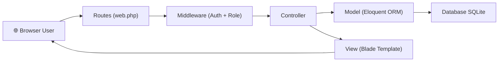
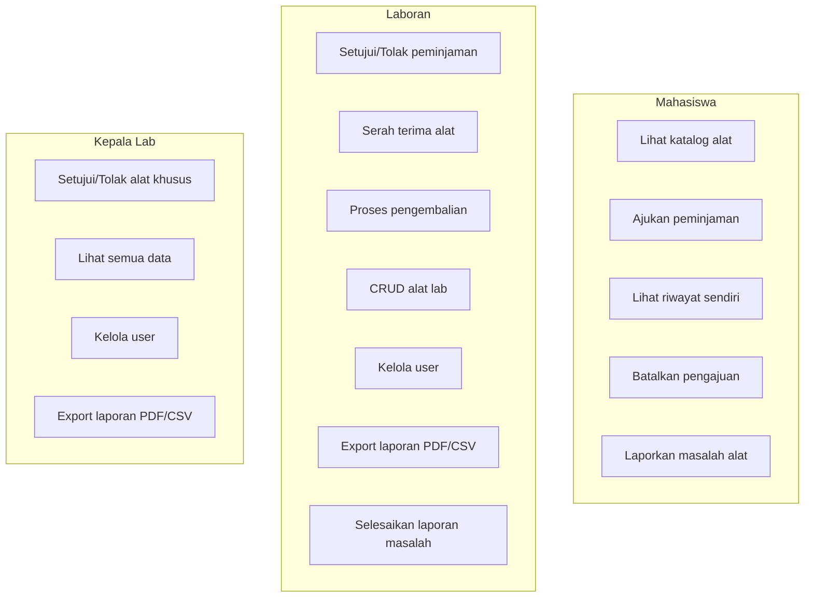
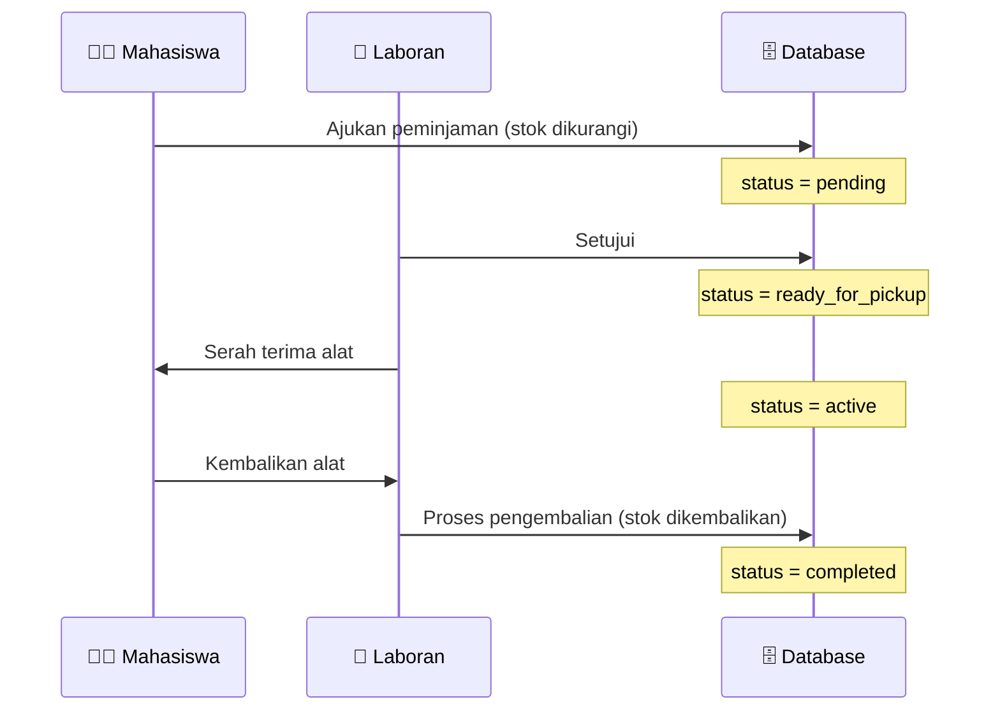
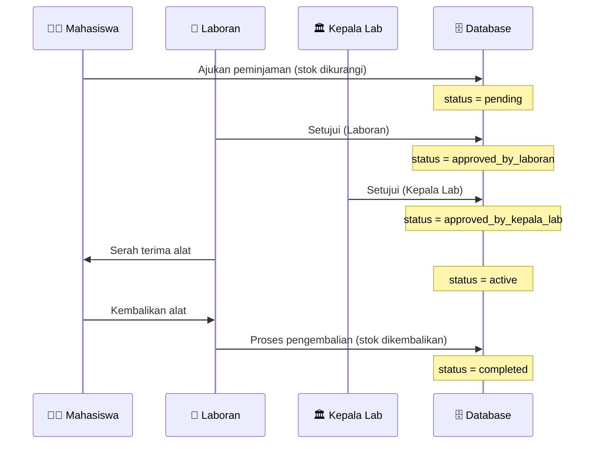
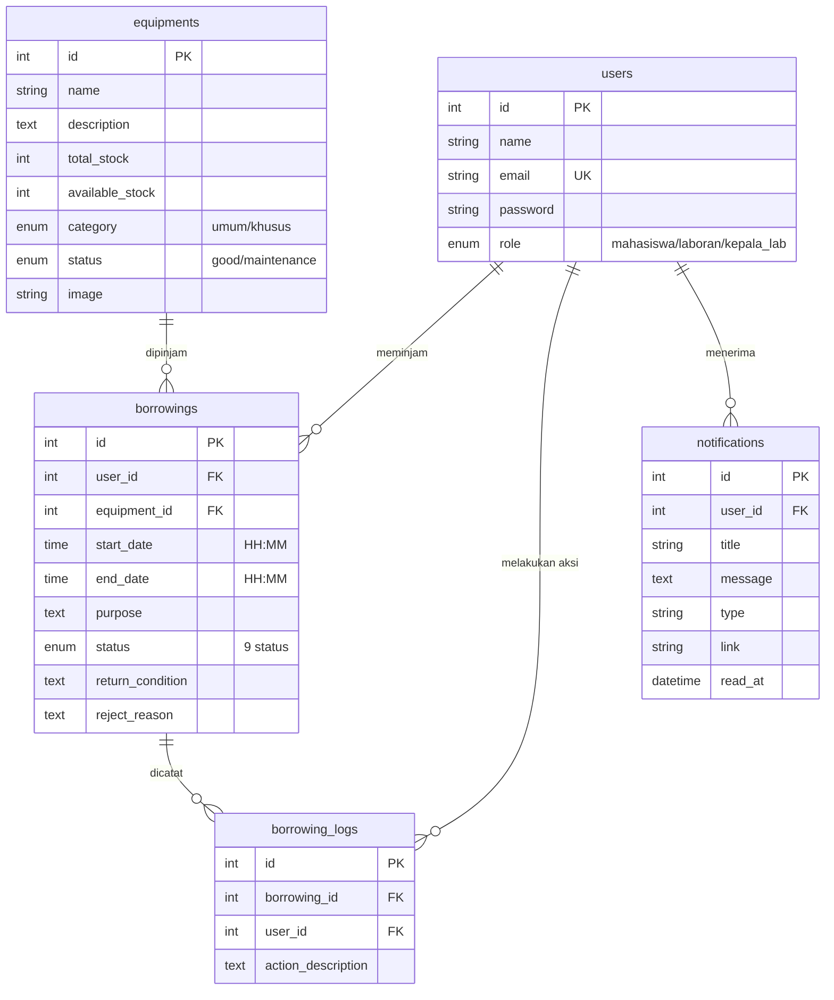

# 🎤 Panduan Presentasi — LabManager

> **Sistem Peminjaman Alat Laboratorium IT** berbasis Laravel 11

Dokumen ini berisi poin-poin yang perlu dijelaskan saat presentasi di depan kelas, disusun dari gambaran umum hingga detail teknis.

---

## 1. Gambaran Umum Project

### Apa itu LabManager?

LabManager adalah **aplikasi web** untuk mengelola peminjaman alat di Laboratorium IT. Sistem ini menggantikan proses manual (buku catatan / kertas) menjadi sistem digital yang terstruktur.

### Masalah yang Diselesaikan

| Masalah Manual | Solusi LabManager |
|---|---|
| Pencatatan di buku bisa hilang/rusak | Semua data tersimpan di database |
| Tidak tahu alat mana yang tersedia | Katalog real-time menampilkan stok |
| Persetujuan membutuhkan tatap muka | Approval digital bertingkat via web |
| Tidak ada jejak audit | Setiap aksi dicatat di *audit log* |
| Risiko double-booking alat | Database locking mencegah tabrakan data |

### Tech Stack yang Digunakan

```
┌─────────────────────────────────────────────┐
│              FRONTEND                        │
│  Tailwind CSS  •  Alpine.js  •  Blade       │
│  Vite (build tool)                          │
├─────────────────────────────────────────────┤
│              BACKEND                         │
│  Laravel 11  •  PHP 8.2+                    │
│  Laravel Breeze (Auth)                      │
├─────────────────────────────────────────────┤
│              DATABASE                        │
│  SQLite (default)                           │
│  Session, Cache, Queue via Database         │
└─────────────────────────────────────────────┘
```

**Kenapa menggunakan tech stack ini?**
- **Laravel 11** — Framework PHP paling populer dengan ekosistem lengkap, MVC pattern, dan fitur bawaan seperti routing, migration, middleware
- **Tailwind CSS** — Utility-first CSS framework untuk styling cepat dan konsisten
- **Alpine.js** — Framework JavaScript ringan untuk interaktivitas tanpa SPA kompleks
- **SQLite** — Database ringan (satu file), cocok untuk development dan project skala lab
- **Vite** — Build tool modern yang lebih cepat dari Webpack

---

## 2. Arsitektur Aplikasi (MVC Pattern)

LabManager mengikuti pola **MVC (Model-View-Controller)** bawaan Laravel:



### Penjelasan tiap layer:

| Layer | File/Lokasi | Fungsi |
|---|---|---|
| **Routes** | [web.php](file:///c:/laragon/www/project-frame(lab%20IT)/routes/web.php) | Mendefinisikan URL dan mapping ke controller |
| **Middleware** | [RoleMiddleware.php](file:///c:/laragon/www/project-frame(lab%20IT)/app/Http/Middleware/RoleMiddleware.php) | Filter request berdasarkan role user |
| **Controller** | `app/Http/Controllers/` | Logika bisnis dan orkestrasi |
| **Model** | `app/Models/` | Representasi tabel database + relasi |
| **View** | `resources/views/` | Template HTML (Blade engine) |

---

## 3. Sistem Role & Hak Akses (RBAC)

Aplikasi memiliki **3 role** dengan hak akses berbeda:



### Implementasi di Kode

Hak akses dikontrol oleh **RoleMiddleware** yang sangat sederhana:

```php
// RoleMiddleware.php
$allowedRoles = explode('|', $roles);
if (!in_array(auth()->user()->role, $allowedRoles)) {
    abort(403);
}
```

Digunakan di routes seperti:
```php
Route::middleware('role:mahasiswa')->group(function () { ... });
Route::middleware('role:laboran')->group(function () { ... });
Route::middleware('role:laboran|kepala_lab')->group(function () { ... });
```

---

## 4. Alur Peminjaman (Business Flow) — ⭐ Poin Penting Presentasi

Ini adalah **inti dari aplikasi** — alur peminjaman dibedakan berdasarkan kategori alat.

### Alat Umum (1 level approval)



### Alat Khusus (2 level approval)



### Status Peminjaman (9 status)

| Status | Label | Warna Badge | Keterangan |
|---|---|---|---|
| `pending` | Menunggu Persetujuan | 🟡 Amber | Baru diajukan |
| `approved_by_laboran` | Disetujui Laboran | 🔵 Blue | Khusus: menunggu Kepala Lab |
| `approved_by_kepala_lab` | Disetujui Kepala Lab | 🟣 Indigo | Menunggu serah terima |
| `ready_for_pickup` | Siap Diambil | 🩵 Cyan | Umum: siap diambil |
| `active` | Sedang Dipinjam | 🟢 Emerald | Alat ada di peminjam |
| `completed` | Selesai | ✅ Green | Sudah dikembalikan |
| `rejected` | Ditolak | 🔴 Red | Ditolak oleh Laboran/KepLab |
| `overdue` | Terlambat | 🟠 Orange | Lewat batas waktu |
| `issue_reported` | Ada Masalah | 🌹 Rose | Mahasiswa melaporkan masalah |

---

## 5. Struktur Database — ⭐ Poin Penting Presentasi

Aplikasi memiliki **6 tabel utama** (+ 3 tabel sistem):



### Relasi Antar Tabel

- **users → borrowings**: One-to-Many (1 mahasiswa bisa punya banyak peminjaman)
- **equipments → borrowings**: One-to-Many (1 alat bisa dipinjam berkali-kali)
- **borrowings → borrowing_logs**: One-to-Many (1 peminjaman punya banyak log)
- **users → notifications**: One-to-Many (1 user bisa punya banyak notifikasi)

---

## 6. Fitur-Fitur Unggulan — ⭐ Jelaskan Saat Demo

### 6.1 Proteksi Race Condition (Double-Booking Prevention)

**Masalah**: Jika 2 mahasiswa mengajukan peminjaman alat yang sama secara bersamaan, dan stok tinggal 1, keduanya bisa berhasil → stok menjadi negatif!

**Solusi**: Menggunakan `DB::transaction()` + `lockForUpdate()` (Pessimistic Locking)

```php
// BorrowingController@store (baris 89-125)
$borrowing = DB::transaction(function () use ($validated) {
    // Lock baris alat → request lain harus menunggu
    $equipment = Equipment::lockForUpdate()->find($validated['equipment_id']);

    if ($equipment->available_stock <= 0) {
        throw new \Exception('Stok alat tidak tersedia.');
    }

    // Kurangi stok DI DALAM transaction
    $equipment->decrement('available_stock');

    // Buat record peminjaman
    return Borrowing::create([...]);
});
```

**Cara jelaskan ke kelas**: *"Bayangkan 2 orang mau ambil barang terakhir di toko secara bersamaan. Tanpa lock, keduanya bisa 'berhasil'. Dengan `lockForUpdate()`, orang kedua harus menunggu orang pertama selesai checkout."*

### 6.2 Approval Multi-Level

**Konsep**: Alat "khusus" (mahal/sensitif) butuh 2 level persetujuan untuk keamanan.

```
Alat Umum:  Mahasiswa → Laboran → Selesai
Alat Khusus: Mahasiswa → Laboran → Kepala Lab → Selesai
```

**Implementasi**: Logika branching di [BorrowingController@approveLaboran](file:///c:/laragon/www/project-frame(lab%20IT)/app/Http/Controllers/BorrowingController.php#L158-L196):

```php
if ($equipment->category === 'umum') {
    $borrowing->update(['status' => 'ready_for_pickup']);
} else {
    $borrowing->update(['status' => 'approved_by_laboran']);
    // Masih butuh approval Kepala Lab
}
```

### 6.3 Audit Log (Riwayat Aktivitas)

Setiap aksi penting dicatat di tabel `borrowing_logs`:

```php
BorrowingLog::create([
    'borrowing_id' => $borrowing->id,
    'user_id'      => auth()->id(),   // siapa yang melakukan
    'action_description' => 'Laboran menyetujui peminjaman...',
]);
```

**Manfaat**: Accountability — bisa dilacak siapa melakukan apa dan kapan.

### 6.4 Deteksi Overdue Otomatis (Scheduler)

Artisan Command [MarkOverdueBorrowings](file:///c:/laragon/www/project-frame(lab%20IT)/app/Console/Commands/MarkOverdueBorrowings.php) berjalan otomatis setiap hari pukul 00:01:

```php
// Kriteria overdue:
// 1. Peminjaman dibuat SEBELUM hari ini (belum dikembalikan)
// 2. Peminjaman dibuat HARI INI tapi sudah lewat jam end_date
$query->whereDate('created_at', '<', $today)
      ->orWhere(function ($q) use ($today, $currentTime) {
          $q->whereDate('created_at', $today)
            ->where('end_date', '<', $currentTime);
      });
```

Dijadwalkan via [console.php](file:///c:/laragon/www/project-frame(lab%20IT)/routes/console.php):
```php
Schedule::command(MarkOverdueBorrowings::class)
    ->dailyAt('00:01')
    ->withoutOverlapping()
    ->runInBackground();
```

### 6.5 Sistem Notifikasi

Notifikasi dikirim otomatis ke mahasiswa saat:
- ✅ Peminjaman disetujui
- ❌ Peminjaman ditolak
- 🔄 Menunggu approval Kepala Lab

Implementasi via static helper di [Notification model](file:///c:/laragon/www/project-frame(lab%20IT)/app/Models/Notification.php#L46-L55):
```php
Notification::send($userId, 'Judul', 'Pesan detail...', 'success', $url);
```

### 6.6 Export Laporan (PDF & CSV)

Laboran dan Kepala Lab dapat mengekspor data peminjaman:
- **PDF** — menggunakan library `barryvdh/laravel-dompdf`
- **CSV** — tanpa library tambahan, native PHP `fputcsv()`

### 6.7 Dynamic Session Lifetime

Fitur "Ingat Saya" saat login:
- **Tanpa centang**: Session habis dalam 3 jam
- **Dengan centang**: Session bertahan 1 hari

Dikontrol oleh [EnforceSessionLifetime middleware](file:///c:/laragon/www/project-frame(lab%20IT)/app/Http/Middleware/EnforceSessionLifetime.php).

### 6.8 Dark Mode

Aplikasi mendukung **dark mode** dengan:
- CSS Custom Properties (variabel warna)
- LocalStorage untuk menyimpan preferensi user
- Transisi animasi smooth saat beralih tema

---

## 7. Pola Desain yang Digunakan — ⭐ Poin Teknis untuk Nilai Lebih

| Pola Desain | Implementasi | File |
|---|---|---|
| **MVC** | Model-View-Controller Laravel | Seluruh arsitektur |
| **Middleware Pattern** | Filter request sebelum masuk controller | `RoleMiddleware`, `EnforceSessionLifetime` |
| **View Composer** | Inject data ke view tanpa mengubah controller | [EquipmentImageComposer](file:///c:/laragon/www/project-frame(lab%20IT)/app/View/Composers/EquipmentImageComposer.php) |
| **Scope (Query Scope)** | Reusable query filter di Model | `Equipment::available()` |
| **Accessor** | Computed attribute pada Model | `getStatusLabelAttribute()`, `getStatusColorAttribute()` |
| **Pessimistic Locking** | Cegah race condition | `lockForUpdate()` di `BorrowingController@store` |
| **Command Pattern** | Artisan command untuk task otomatis | `MarkOverdueBorrowings` |
| **Scheduler** | Cron-like job scheduling | `routes/console.php` |
| **Database Transaction** | Atomicity untuk operasi multi-step | `DB::transaction()` |

---

## 8. Keamanan Aplikasi

| Aspek | Implementasi |
|---|---|
| **Autentikasi** | Laravel Breeze (login, logout, hashing bcrypt) |
| **Otorisasi** | Role-based middleware + validasi di controller |
| **CSRF Protection** | Token otomatis oleh Laravel di setiap form |
| **SQL Injection** | Dicegah oleh Eloquent ORM (parameterized queries) |
| **Race Condition** | `lockForUpdate()` + `DB::transaction()` |
| **Session Hijacking** | Dynamic session lifetime + database driver |
| **Self-modification Guard** | User tidak bisa menghapus/ubah role akun sendiri |
| **Ownership Check** | Mahasiswa hanya bisa lihat/aksi peminjaman miliknya |

---

## 9. Fitur UI/UX

| Fitur | Keterangan |
|---|---|
| **Responsive Design** | Tampilan adaptif untuk desktop, tablet, dan mobile |
| **Glassmorphism Cards** | Efek blur + transparansi pada kartu statistik |
| **Sidebar Navigation** | Sidebar tetap dengan menu sesuai role user |
| **Page Transitions** | Animasi `fadeInUp` saat masuk halaman |
| **Badge Warna Dinamis** | Status peminjaman ditampilkan dengan warna yang berbeda |
| **Dark/Light Mode** | Toggle tema tanpa reload halaman |
| **Notifikasi Bell** | Indikator notifikasi belum dibaca di navbar |
| **Filter & Search** | Pencarian dan filter pada daftar peminjaman dan katalog |

---

## 10. Struktur File Project

```
project-frame(lab IT)/
├── app/
│   ├── Console/Commands/
│   │   └── MarkOverdueBorrowings.php   ← Scheduler overdue
│   ├── Http/
│   │   ├── Controllers/
│   │   │   ├── BorrowingController.php  ← Logika utama peminjaman (538 baris)
│   │   │   ├── DashboardController.php  ← Dashboard per-role
│   │   │   ├── EquipmentController.php  ← CRUD alat + katalog
│   │   │   ├── NotificationController.php ← Kelola notifikasi
│   │   │   ├── UserController.php       ← CRUD user
│   │   │   └── ProfileController.php    ← Edit profil
│   │   └── Middleware/
│   │       ├── RoleMiddleware.php        ← Guard akses role
│   │       └── EnforceSessionLifetime.php ← Session dinamis
│   ├── Models/
│   │   ├── Borrowing.php    ← 9 status + accessor label/warna
│   │   ├── BorrowingLog.php ← Audit log
│   │   ├── Equipment.php    ← Scope available()
│   │   ├── Notification.php ← Static helper send()
│   │   └── User.php         ← Role helpers
│   └── View/Composers/
│       └── EquipmentImageComposer.php ← Inject gambar alat
├── database/
│   ├── migrations/       ← 9 file migration
│   ├── seeders/          ← 3 akun + 15 alat lab
│   └── database.db       ← File database SQLite
├── resources/views/
│   ├── auth/             ← Halaman login
│   ├── borrowings/       ← Form + list + detail peminjaman
│   ├── dashboard/        ← 3 dashboard berbeda per role
│   ├── equipments/       ← Katalog + CRUD alat
│   ├── notifications/    ← Daftar notifikasi
│   ├── users/            ← CRUD user
│   └── layouts/          ← Layout utama + guest
└── routes/
    ├── web.php           ← Semua route (75 baris)
    ├── auth.php          ← Route autentikasi
    └── console.php       ← Jadwal scheduler
```

---

## 11. Akun Demo untuk Presentasi

| Role | Email | Password |
|---|---|---|
| 🎓 Mahasiswa | `mahasiswa@lab.test` | `password` |
| 🔬 Laboran | `laboran@lab.test` | `password` |
| 🏛️ Kepala Lab | `kepalalab@lab.test` | `password` |

---

## 12. Skenario Demo yang Disarankan

### Demo 1: Alur Lengkap Peminjaman Alat Umum
1. Login sebagai **Mahasiswa** → lihat katalog → ajukan peminjaman alat **umum** (contoh: Laptop ASUS ROG)
2. Login sebagai **Laboran** → lihat dashboard → setujui permintaan → serah terima alat
3. Login kembali sebagai **Laboran** → proses pengembalian

### Demo 2: Alur Alat Khusus (2 Level Approval)
1. Login **Mahasiswa** → pinjam alat **khusus** (contoh: Cisco Router 2901)
2. Login **Laboran** → setujui → status berubah ke "Disetujui Laboran"
3. Login **Kepala Lab** → setujui → status berubah ke "Disetujui Kepala Lab"
4. Login **Laboran** → serah terima

### Demo 3: Fitur Penolakan
1. Ajukan peminjaman → Login **Laboran** → tolak dengan alasan
2. Tunjukkan notifikasi penolakan di akun Mahasiswa

### Demo 4: Manajemen Alat
1. Login **Laboran** → tambah alat baru → edit → hapus

### Demo 5: Dark Mode & Responsivitas
1. Klik toggle tema → tunjukkan dark mode
2. Resize browser → tunjukkan tampilan mobile

---

## 13. Pertanyaan yang Mungkin Ditanyakan Dosen/Teman

### Q: Kenapa pakai SQLite, bukan MySQL?
> **A**: SQLite dipilih karena ringan (hanya satu file `database.db`), tidak perlu install server database terpisah, dan cocok untuk skala project lab. Namun bisa diganti ke MySQL/PostgreSQL dengan mengubah konfigurasi di file `.env`.

### Q: Bagaimana mencegah double-booking?
> **A**: Menggunakan **Pessimistic Locking** (`lockForUpdate()`) di dalam `DB::transaction()`. Ini memastikan hanya satu request yang bisa mengakses baris alat pada satu waktu. Request lain harus menunggu transaction pertama selesai.

### Q: Kenapa stok dikurangi saat status masih "pending"?
> **A**: Ini **desain yang disengaja**, bukan bug. Jika stok baru dikurangi setelah disetujui, maka 10 mahasiswa bisa mengajukan peminjaman untuk alat yang stoknya hanya 1. Stok dikembalikan jika permintaan ditolak atau alat dikembalikan.

### Q: Apa bedanya View Composer dan kirim data dari Controller?
> **A**: View Composer inject data secara otomatis ke view tertentu tanpa mengubah controller. Misalnya, `EquipmentImageComposer` otomatis menyediakan peta gambar alat ke semua view equipment, sehingga controller tidak perlu mengirim data ini berulang kali.

### Q: Bagaimana sistem mendeteksi peminjaman terlambat?
> **A**: Menggunakan **Laravel Scheduler** — command `borrowings:mark-overdue` dijalankan otomatis setiap hari pukul 00:01. Command ini mengecek apakah ada peminjaman aktif yang sudah melewati batas waktu pengembalian.

### Q: Kenapa waktu pinjam berbasis jam (HH:MM) bukan tanggal?
> **A**: Karena Lab IT beroperasi harian (08:00–20:00 WIB). Peminjaman berlaku untuk hari yang sama. Ini menyederhanakan logika dan sesuai kebutuhan nyata lab.

### Q: Bagaimana menangani jika alat rusak saat dipinjam?
> **A**: Ada fitur **Report Issue** — mahasiswa bisa melaporkan masalah saat status peminjaman "active". Laboran kemudian bisa memilih: lanjutkan peminjaman (masalah ditangani) atau selesaikan dan tarik alat.

---

## 14. Statistik Codebase

| Metrik | Jumlah |
|---|---|
| **Controllers** | 7 file |
| **Models** | 5 file |
| **Middleware** | 2 file (custom) |
| **Migrations** | 9 file |
| **Views** | ~15+ file Blade |
| **Routes** | ~25 route (web) |
| **Seeder** | 3 file (users + alat) |
| **Total baris BorrowingController** | 538 baris |
| **Status peminjaman** | 9 status |
| **Alat lab yang di-seed** | 15 alat |

---

> [!TIP]
> **Tips Presentasi**: Fokuskan penjelasan pada **Alur Peminjaman** (bagian 4) dan **Fitur Unggulan** (bagian 6) — ini adalah jantung dari project. Detail teknis seperti Race Condition dan Audit Log bisa menjadi nilai tambah saat Q&A.
